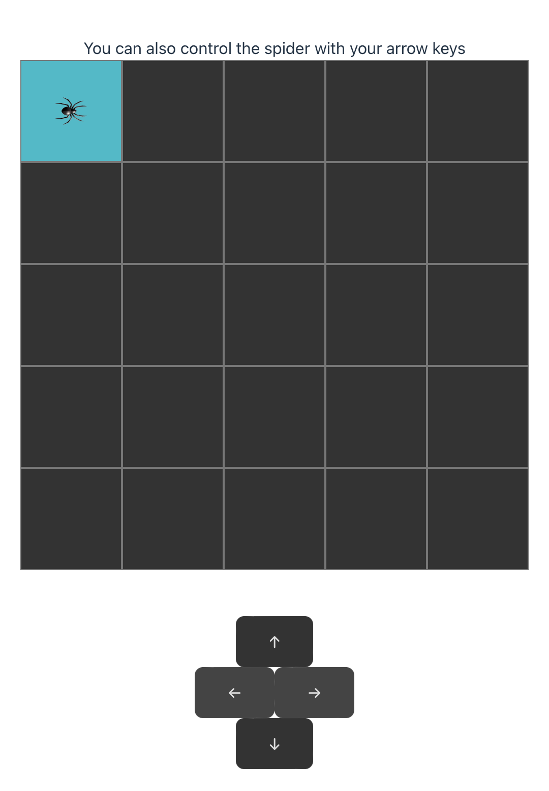

# Robot Blocks App

This project was created with with the combination of `React + TypeScript + Vite`.

You can check out the link for this project: https://pipe-mv.github.io/robot-blocks/

### What is this?

This is a repo that the base code for a React.js application. The robot Blocks app will allow the user to move a spider inside of a box in an area made of 5X5 boxes!

## Don't be scare of the spider, Clone the repository!

Then run:

### `npm install`

Finally, run:

### `npm run dev`
